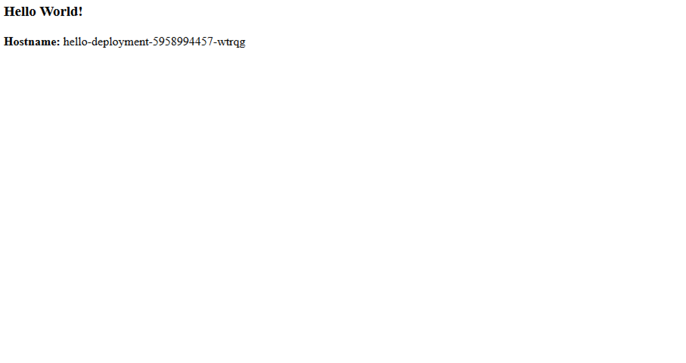

# Segmented ICP Network Architecture

## Implementation of segmented ICP network design using Calico


### **Purpose: Configure traffic filtering for the Application layer containers in order to allow external connections from selected subnets and also ICP-internal connections from selected containers in this network topology with Calico security policies <span style="color:red">(*traffic shown with the red arrows in the diagram*)</span>.**


Note: The necessity of Proxy Nodes in front of the worker nodes in the DMZ is being examined.


## For experienced users:

- Use NodeSelectors in your deployment to run your Application tier containers on specific worker nodes.

- Expose your Application tier Service with ExternalTrafficPolicy option set to "Local", instead of the default value of "Cluster". Example service definition:

```yaml
apiVersion: v1
kind: Service
metadata:
  labels:
    app: hello
  name: hello
spec:
  externalTrafficPolicy: Local
  ports:
    - port: 80
  selector:
    app: hello
  type: NodePort
```

*By setting a value of "Local" for ExternalTrafficPolicy, kube-proxy will not perform any
SNAT on client source IPs thus allowing to filter incoming traffic by Subnet or IP.
Also, by setting the value to "Local", the containers exposed by the Service can be accessed only through the NodePorts on the worker nodes they are running on. kube-proxy will not forward requests to other worker nodes. For high availability and also to facilitate traffic distribution across worker nodes use an external load balancer in front of your worker nodes.*


- Use a combination of Calico policies to filter incoming traffic to your Application containers by Subnet and by labels.

Example calico policy for traffic targeting your container from outside the ICP cluster:


```yaml
apiVersion: v1
kind: policy
metadata:
  name: hello-externaltraffic
spec:
  egress:
  - action: allow
    destination: {}
    source: {}
  ingress:
  - action: allow
    source:
     nets: [10.49.0.0/24, 10.48.0.0/24]
    destination: {}
  order: 400
  selector: calico/k8s_ns == 'default' && app == 'hello'
```


Example calico policy for traffic targeting your container from inside your cluster (e.g. from Web tier containers, in the example shown above.)

```yaml
apiVersion: v1
kind: policy
metadata:
  name: hello-internaltraffic
spec:
  egress:
  - action: allow
    destination: {}
    source: {}
  ingress:
  - action: allow
    source:
     selector: run == 'myubuntu9a'
    destination: {}
  order: 400
  selector: calico/k8s_ns == 'default' && app == 'hello'
```

Apply both of the above calico policies using calico CLI.

**Note:**
*Ingress controller and Ingress rules could be used alternatively to NodePorts for traffic filtering by source subnet through using  whitelist-source-range in the ingress definition, but Ingress controller can only handle HTTP connections; it cannot handle TCP or UDP currently.*


-----


## Detailed Steps:

### Deploy an NGNIX reverse proxy VM and configure it as a load balancer - it will simulate the customer's environment load balancer:
- Install NGINX on a VM
- Use the [load-balancer.conf](https://github.ibm.com/Georgios-Raptis/ICP_assets/blob/master/Firewall/Segmented%20Network%20Design/load-balancer.conf) file to configure load balancing to your worker nodes. *Use the IPs of your worker nodes that you have placed in the network zone "App Network Zone" shown in the diagram in your environment. Replace the port number "32619" with the port number where your container Application service will be exposed to - the steps to create your Application service are described in the Section "Create a Service for your deployment" below.*


```
upstream myhelloapp {

    server 10.49.0.32:32619 max_fails=1 fail_timeout=1s;
    server 10.49.0.35:32619 max_fails=1 fail_timeout=1s;
}


server {
   listen 80;


   location / {
      proxy_read_timeout 2s;
      proxy_send_timeout 2s;
      proxy_connect_timeout 10ms;
      proxy_next_upstream error timeout invalid_header http_500 http_502 http_503 http_504;
      proxy_pass http://myhelloapp;
   }
}
```


### Deploy the Application zone containers
Create a deployment on ICP using the [hello-world](https://github.ibm.com/Georgios-Raptis/ICP_assets/tree/master/Docker/Python) docker image. *This will simulate the Application containers*.
For the deployment use [hello-deployment.YAML](https://github.ibm.com/Georgios-Raptis/ICP_assets/blob/master/Firewall/Segmented%20Network%20Design/hello-deployment.yaml) file. It is required you have previously uploaded the hello-world docker image to your ICP registry.
*Note: To test the calico security policies discussed below you can use any docker image of your preference. In this example we use the hello docker image.*

The deployment specification uses **NodeSelector** labels to force scheduling of the Application layer containers (hello docker image) on the specific worker nodes according to our network design.


```YAML
apiVersion: apps/v1beta2 # for versions before 1.9.0 use apps/v1beta2
kind: Deployment
metadata:
  name: hello-deployment
  labels:
    app: hello
spec:
  replicas: 3
  selector:
    matchLabels:
      app: hello
  template:
    metadata:
      labels:
        app: hello
    spec:
      containers:
      - name: hello
        image: eucluster.icp:8500/default/hello
        ports:
        - containerPort: 80
      nodeSelector:
       zone: "app-network"
```

Label your worker nodes accordingly:
*Replace the IP addresses with those from your worker nodes*

```shell
kubectl label nodes 10.49.0.32 zone=app-network
kubectl label nodes 10.49.0.35 zone=app-network
```

Verify the new labels have been applied on your worker nodes:

```shell
kubectl get nodes --show-labels
```


Run the below command for the deployment:
```shell
kubectl create -f hello-deployment.yaml
```

Verify that your hello pods have been scheduled and are running on your selected worker nodes labeled with "zone=app-network".


```shell
kubectl get pods -o wide | grep hello
```


### Create a Service for your deployment
Use the [hello-service.yaml](https://github.ibm.com/Georgios-Raptis/ICP_assets/blob/master/Firewall/Segmented%20Network%20Design/hello-service.yaml) to create a NodePort type Service for exposing your application servers outside your ICP cluster.


*The below service definition sets ExternalTraffic policy to* **"Local"** *instead of the default value of* **"Cluster"** *so as to retain client source IPs. By default kube-proxy performs source NAT and as a result the client source IP is replaced by the worker's IP. This would not allow us to filter incoming traffic by subnet.

Additionally, with the ExternalTrafficPolicy policy value set to "Local", clients can access the Service only through connecting to the worker node where the container is running.*


```yaml
apiVersion: v1
kind: Service
metadata:
  labels:
    app: hello
  name: hello
spec:
  externalTrafficPolicy: Local
  ports:
    - port: 80
  selector:
    app: hello
  type: NodePort
```


Create the service:
```shell
kubectl create -f hello-service.yaml
```


### Create Calico security policies

- Create a Calico policy for limiting incoming traffic to the subnet for the network zone where the Application servers will reside. Use the calico policy file [hello-externaltraffic.yaml](https://github.ibm.com/Georgios-Raptis/ICP_assets/blob/master/Firewall/Segmented%20Network%20Design/hello-externaltraffic.yaml).


This policy definition permits access to the containers only from specific subnets (10.49.0.0/24 and 10.48.0.0/24 in my lab environment). *Adjust subnet values with your environment*

```yaml
apiVersion: v1
kind: policy
metadata:
  name: hello-externaltraffic
spec:
  egress:
  - action: allow
    destination: {}
    source: {}
  ingress:
  - action: allow
    source:
     nets: [10.49.0.0/24, 10.48.0.0/24]
    destination: {}
  order: 400
  selector: calico/k8s_ns == 'default' && app == 'hello'
```


Install calico CLI tool. For instructions see [IBM Cloud Private documentation](https://www-03preprod.ibm.com/support/knowledgecenter/SSBS6K_2.1.0/manage_network/calicoctl.html)

Apply the calico policy using:

```shell
calicoctl apply -f hello-externaltraffic.yaml
```


- Create a Calico policy for allowing traffic from the web containers of your Application.

Use the calico policy file [hello-externaltraffic.YAML](https://github.ibm.com/Georgios-Raptis/ICP_assets/blob/master/Firewall/Segmented%20Network%20Design/hello-internalltraffic.yaml).


This policy definition permits access to our hello containers only from selected other containers. In our example, we are using an **ubuntu** container.

```yaml
apiVersion: v1
kind: policy
metadata:
  name: hello-internaltraffic
spec:
  egress:
  - action: allow
    destination: {}
    source: {}
  ingress:
  - action: allow
    source:
     selector: run == 'myubuntu9a'
    destination: {}
  order: 400
  selector: calico/k8s_ns == 'default' && app == 'hello'
```

Apply this calico policy using:

```shell
calicoctl apply -f hello-internaltraffic.YAML
```


List the currently active calico policies:

```shell
calicoctl get policy
```

Verify the configuration that has been enforced by each of the two above policies:

```shell
calicoctl get pol hello-internaltraffic -o yaml
calicoctl get pol hello-externaltraffic -o yaml
```


### Deploy a custom Ubuntu container in the DMZ worker nodes for testing access to your hello containers.

Deploy a custom Ubuntu container:

```shell
kubectl run -it myubuntu9a --image=eucluster.icp:8500/default/myubuntu  -- /bin/bash
```


Dockerfile to build the above custom Ubuntu container:

```Dockerfile
FROM ubuntu
RUN apt-get update && apt-get install -y \
    inetutils-ping \
    telnet \
    ssh \
    curl \
    dnsutils \
    net-tools \
    vim \
    less \
 && rm -rf /var/lib/apt/lists/*
RUN echo 'root:root123' | chpasswd
RUN sed -i 's/prohibit-password/yes/' /etc/ssh/sshd_config
```

Label your custom Ubuntu container according to your Calico policy:

```shell
kubectl label pods myubuntu9a app=hello
```


Deploy second custom Ubuntu container:

```shell
kubectl run -it myubuntu9b --image=eucluster.icp:8500/default/myubuntu  -- /bin/bash
```


### Test the above network security policies

With the above calico policies in effect:

- Verify access to the hello NodePort Service by connecting with your browser to your first worker node in the App Network Zone of the diagram.
- Verify access to the hello NodePort Service by connecting with your browser to your second worker node in the App Network Zone of the diagram.

You should see the webpage served by each of the two containers in your hello deployment.





- Verify connectivity to your hello service from your ubuntu9 **a** container:

Enter your container:
```
kubectl exec -ti yourubuntucontainer-a bash
```

Connect to hello service:
```shell
    curl http://hello
```
You should be able to see the webpage.


- Verify connectivity to your hello service from your ubuntu9 **b** container:

Enter your container:
```
kubectl exec -ti yourubuntucontainer-b bash
```

Connect to hello service:
```shell
    curl http://hello
```
You should **NOT** be able to see the webpage.


- Disable calico policy "hello-externaltraffic":
```   
calicoctl delete policy hello-externaltraffic
```
Test again your connection to the hello NodePort Service. You should **NOT** be able to access it anymore.


- Test connection to your hello service from your Ubuntu9a container:

Enter your container:
```
kubectl exec -ti yourubuntucontainer bash
```

Connect to hello service:
```shell
    curl http://hello
```
You should **NOT** be able to see the webpage anymore.


- Reapply the Calico policy

```
calicoctl apply -f hello-externaltraffic.YAML
```


- Access your hello service from your NGINX Load Balancer

You should be able to see the webpage.

Refreshing the page several times should balance the connections across your two worker nodes and your two containers.

- Scale down your deployment to 1 container.
Edit your deployment:
```
kubectl edit deployment hello-deployment
  ```


Reduce the number of replicas to 1.
Save and exit.

- Access your hello service from your NGINX LOad Balanceragain.

Refresh the page multiple times. Your client should connect to your page without any failures.


**Note: You need to disable yuour browser cache**


## Summary


Calico network policies can be further tailored to allow/prevent access to/from specific containers, subnets/IPs ports.

Further research is in progress to test similar network filtering options using Calico Host Security with preDNAT setting.


### Proxy Nodes / ingress
Source Subnet filtering can be also achieved with the use of whitelist-source-range in the ingress definition, but ingress controllers can only handle HTTP connections.


### References

- [IBM Cloud Blog post](https://www.ibm.com/blogs/bluemix/2017/07/kubernetes-and-bluemix-container-based-workloads-part5/) for Kubernetes Nework policies and Calico policies from Jeffrey Kwong.
- [Kubernetes documentation regarding Source IP and ExternalTrafficPolicy](https://kubernetes.io/docs/tutorials/services/source-ip/)
- [Calico Advanced Network Policy](https://docs.projectcalico.org/v2.4/getting-started/kubernetes/tutorials/advanced-policy)
- [Using Calico to Secure Host Interfaces](https://docs.projectcalico.org/v2.4/getting-started/bare-metal/bare-metal)
